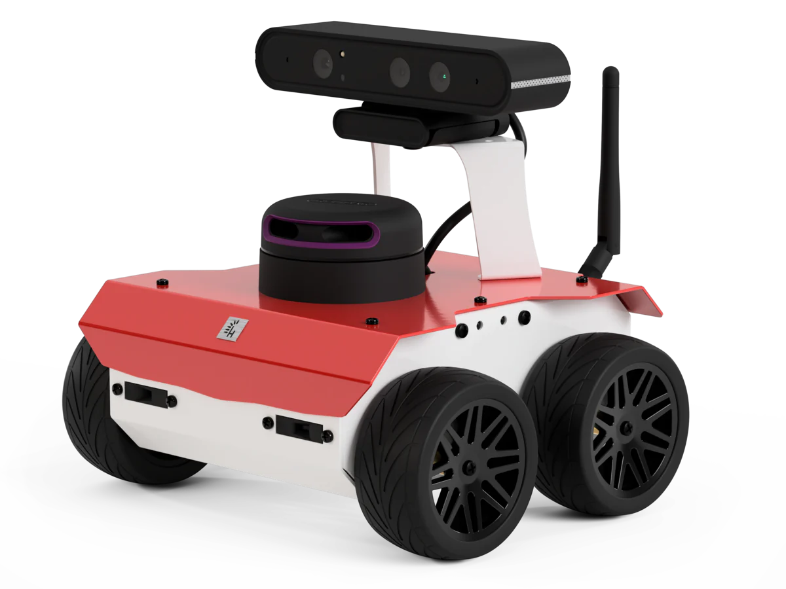
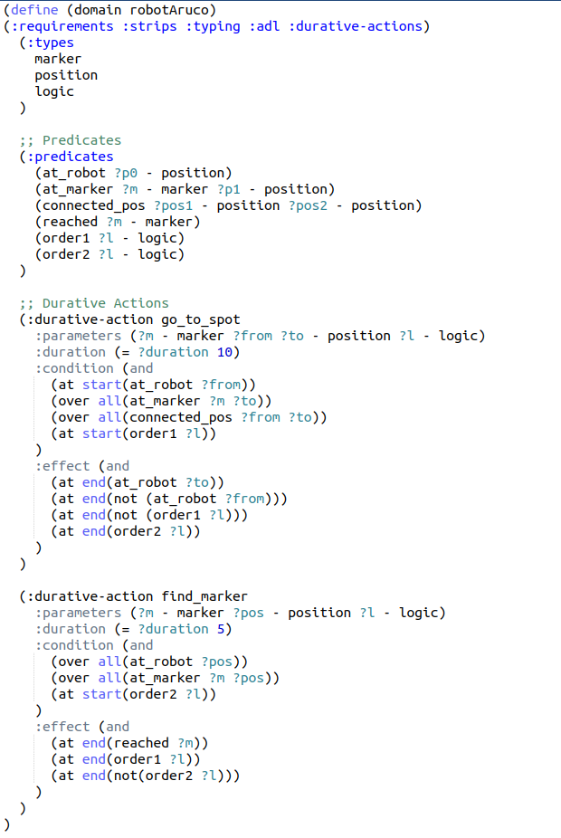
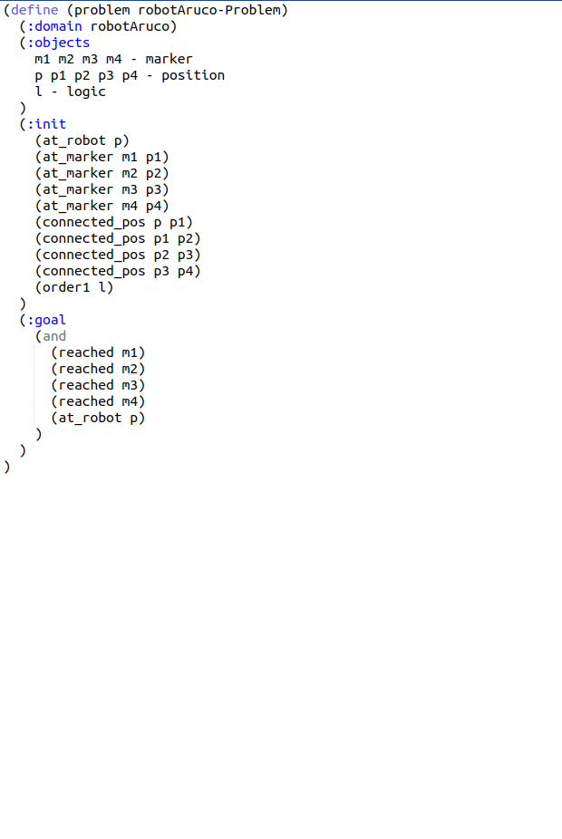
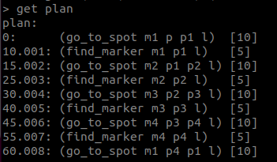

# Experimental Robotics Laboratory - Assignment 2

C. Demaria (s5433737) 🤓

G. Galvagni (s5521188) 🤓

E. Piacenti (s5636699) 🤓

## Description 📑

In this assignment we have developed a ROS2 package that lets a mobile robot, endowed with a camera, do the following tasks:

1) find all markers in the environment.

2) go back to the starting position.

3) get around obstacles using the Bug0 algorithm.

In order to detect the markers ID, the ArUco and the OpenCV packages are being used and the information about the markers to be reached are:
- marker 11 is visible from the position x = 6.0, y = 2.0
- marker 12 is visible from the position x = 7.0, y = -5.0
- marker 13 is visible from the position x = -3.5, y = -8.0
- marker 15 is visible from the position x = -7.0, y =-1.5

This project is implemented in simulation using the world file assignment2.world.

Lastly, we intend to utilize PlanSys2 as the planning framework to design and synchronize the robot's activities.

## The Robot 🤖

In the simulation, we are using the model of the ROSbot2R, a mobile robot platform designed for use with the Robot Operating System (ROS), defined in the rosbot_description package.
The robot has an RGBD Camera used to visualize the surrounding environment and detect interest objects.

<figure>

</figure>
 

## PDDL

The Planning Domain Definition Language (PDDL) file included in this repository (</plansys2_assignment_pkg/pddl>) defines the planning domain for the robotic system. This file specifies the types, predicates, and durative actions necessary for the robot to accomplish the assigned tasks of marker localization and navigation.

Domain Elements:
1) Types:
- marker: Represents markers or points of interest.
- position: Represents locations or positions in the environment.

2) Predicates:
- (at_robot ?p0): Indicates that the robot is at position ?p0.
- (at_marker ?m ?p1): Specifies that marker ?m is at position ?p1.
- (connected_pos ?pos1 ?pos2): Denotes a connection between positions ?pos1 and ?pos2.
- (reached ?m): Indicates that marker ?m has been reached.

3) Durative Actions:
- go_to_marker: Represents the action of the robot moving from position ?from to ?to to reach marker ?m.
- find_marker: Represents the action of the robot finding marker ?m at position ?pos.

These are our domain and problem files, and the corresponding output plan:

  
  

<figure>

</figure>
 

## Logic of the program 🔄

The pddl domain simply contains two durative-actions: *go_to_marker* and *find_marker*.  

  
**Go_to_marker:**

This durative-action triggers the *go_to_action_node* node, which using a service call enables a bug0 algorithm to work. The *bug0* node manages the behavior of *wall_follow* and *go_to_point* nodes, in order to let the robot reach the desired position avoiding the obstacles met along the path. When the desired position is reached, the *bug0* uses another service call in order to inform the *go_to_action_node* that the goal is concluded.  

**Find_marker:**

This durative-action triggers the *marker_searcher_action* node, which using a service call enables the searching for the marker. The *motor_motion_node* is responsible for letting the robot rotate on itself, while the *camera_check_node* simply tries to detect the aruco marker that from this position should be visible from the robot. When it recognizes the corresponding marker, the robot stops rotating and it gives back to the *marker_searcher_action* node the information that the goal has been reached.

## THE NODES

**go_to_action_node** and **marker_searcher_action**

The GoToAction and MarkerSearcherAction nodes are designed to be action executors within the ROS 2 environment and are responsible for executing specific actions within the defined planning domain.
They serve basically as the bridge between the high-level planning specified in the PDDL file and the actual execution of actions on the robotic platform.

Features:
- Extends the ActionExecutorClient class, allowing seamless integration with PlanSys2 actions.
- Utilizes an Action Client (ActionExecutorClient) to manage the execution of the durative actions 'go_to_marker' and 'find_marker'.
- Provides services (/response_go_to and /response_marker_searcher) to handle responses and completion status of 'go_to_marker' and 'find_marker' actions respectively.
- Communicates with an additional service client (/go_to_marker and /search_marker) to trigger the initiation of 'go_to_marker' and 'find_marker' actions.
- Configurable parameters, such as action_name and timeout_sec, for adapting to specific use cases.

**go_to_point_srv**

The GoToPoint node focuses on robotic navigation by directing the robot to move toward a specified point in its environment. This node utilizes odometry information to adjust the robot's orientation and linear movement. The robot can be switched between an active and inactive state using a service call.

Features:
- Tracks robot state variables including position (x, y) and yaw orientation.
- Implements a finite-state machine to manage different stages of movement.
- Accepts a desired goal position and performs the necessary actions to reach it.
- Utilizes proportional controllers for both angular and linear movements.
- Offers ROS2 services to switch the node's active state and provide feedback on completion.
- Subscribes to odometry and laser scan topics for real-time sensor feedback.
- Provides flexibility in adjusting parameters such as precision, proportional gains, and bounds.

**wall_follow_srv**

This node implements a wall-following behavior based on laser scan data. It switches between different states (finding the wall, turning left, and following the wall) and adjusts the robot's movement accordingly. The state transitions are determined by the presence and distances of obstacles in different regions according to laser scan readings.

Features:
- Subscribes to the /scan topic to receive laser scan data, providing information about the robot's surroundings.
- Implements a wall-following strategy with three distinct states: finding the wall, turning left, and following the wall.
- Exposes a service (/wall_follower_switch) to dynamically activate or deactivate the wall-following behavior.
- Utilizes a finite-state machine to manage different wall-following scenarios.
- Adjusts the robot's velocity and angular velocity using Twist messages to navigate and follow the wall.
- Incorporates configurable distance thresholds (d0 and d) to determine proximity to obstacles and make corresponding decisions.

**bug0**

The Bug0 node is a ROS 2 implementation of the Bug 0 algorithm for mobile robot navigation. The Bug 0 algorithm is a simple method that combines "go-to-point" and "wall-following" behaviors to reach a desired goal point while avoiding obstacles.

Features:
- Utilizes laser scan data and odometry information to navigate in its environment.
- Implements a state machine with three states:
- - Go to point (State 0): The robot moves directly towards the goal point.
- - Wall following (State 1): If an obstacle is encountered during the "go to point" phase, the robot switches to following the wall until a clear path is available.
- - Done (State 2): Indicates successful completion of the goal point or the task.
- Supports a service (/go_to_marker) to trigger the Bug 0 algorithm and start the navigation process.
- Capable of handling asynchronous service calls and continuously adjusting its behavior based on laser readings and robot position.

**camera_check_node**

The CameraCheck node is responsible for monitoring and controlling the robot's behavior based on ArUco marker detection. This node interacts with the robotic system to achieve marker-based navigation.

Features:
- Provides a service (/search_marker) to initiate or stop the marker search process.
- Subscribes to the 'aruco_markers' topic to receive information about detected ArUco markers.
- Uses a publisher to send control signals to the 'motor_rotation_on_off' topic for activating or deactivating the robot's rotation.
- Implements a controller logic loop to determine the next ArUco marker to reach based on a predefined list of goal markers.
- Dynamically adjusts its behavior based on the state of the marker search service and the presence of the target marker.

**motor_motion_node**

The MotorControl node is responsible for controlling the robot's movement, specifically focusing on the rotation of the robot. This node subscribes to odometry and rotation on/off topics and adjusts the robot's behavior accordingly.

Features:
- Subscribes to the 'odom' topic to receive odometry information for updating the robot's orientation and to the 'motor_rotation_on_off' topic to receive signals for starting or stopping the robot's rotation.
- Publishes velocity commands to the 'cmd_vel' topic, influencing the robot's rotating movement.
- Utilizes a flag variable (flag) to manage the robot's behavior:
- - flag = 0: Initiates rotation based on received signals.
- - flag = -1: Waits for the next rotation goal.

## Install and run ⚙

First of all, you need to download the repository with the following command inside your workspace:

    git clone https://github.com/claudioDema99/ExpLab-FinalAssignment

From the root directory of your ROS2 workspace run the command:

    colcon build

If the package *plansys2_tools* has problems during building, we suggest building itself later as shown:

    colcon build --packages-select plansys2_tools

Now, you have to launch all the nodes using:

    ros2 launch plansys2_assignment_pkg assignment2.launch.py

To start the problem file, you should run:

    ros2 run plansys2_terminal plansys2_terminal
    
Finally, inside the *plansys2_terminal* node, type the commands contained inside the *plansys2_assignment_pkg/launch/problem_command.txt* file.  
With the last command (*run*), the robot should start the movements decided by the pddl planner.

## Videos 📼

The video showcasing the robot's motion in the Gazebo environment as it navigates and interacts with its surroundings. The video provides a visual representation of how the robot responds to the environment, demonstrating its movements and behaviors:

https://github.com/claudioDema99/ExpLab-FinalAssignment/assets/114250896/481f7781-e3cb-4340-b96e-0287b0dfc617

The robot's camera provides a visual feed through an Rviz video, offering a view into its perspective and visual observations. This video stream allows us to gain insight into what the camera captures and how it operates. Additionally, the LiDAR data is represented by a red line or group of points in the visualization, indicating the obstacles detected in the environment. This information is crucial for the robot to navigate and control its movements, helping it avoid obstacles and make informed decisions based on its surroundings:

[Rviz_rec2_camandlidar.webm](https://github.com/claudioDema99/ExpLab-FinalAssignment/assets/114250896/9ace0bf3-9199-46a9-b458-4a786eb0a6ac)

## Possible improvements 📈

The Bug0 algorithm is a simple navigation algorithm designed for mobile robots, commonly used for obstacle avoidance and pathfinding in environments where the robot needs to reach a goal position while avoiding obstacles.  
The first suggested improvement regards the Bug0 algorithm: for example, enhancing its adaptability and efficiency in navigating the robot through its environment, dynamically adapting goals based on the surroundings, and optimizing rotation strategies with the possibility to let the robot rotate in each sense, so improving obstacle avoidance with consideration for obstacle shapes. These enhancements collectively aim to make the Bug0 algorithm more robust and effective in different navigation scenarios.

Other more general improvements could allow users to easily tune parameters for controllers, planners, or other critical components through launch file arguments or configuration files (also providing guidelines or documentation on how to optimize parameters for specific scenarios and robot models).  
Extend the planning domain to handle more complex scenarios and tasks, and also develop a simple user interface that allows users to interact with the robot, set goals, or monitor its activities in real-time.

